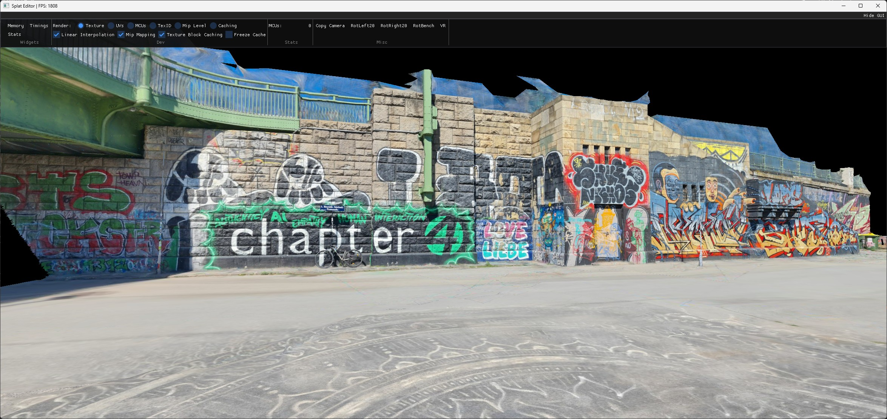
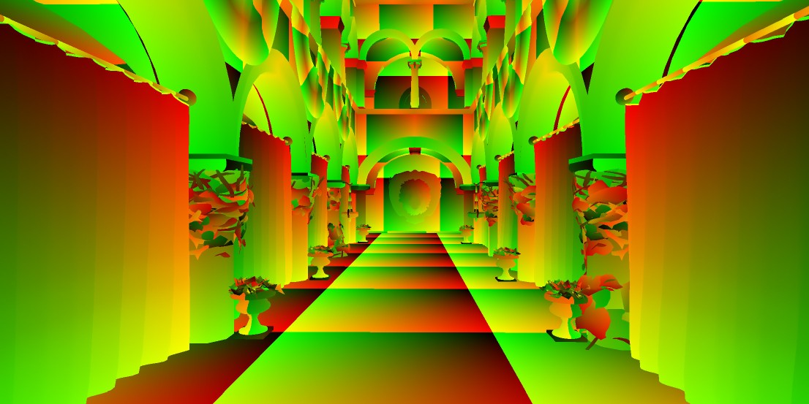
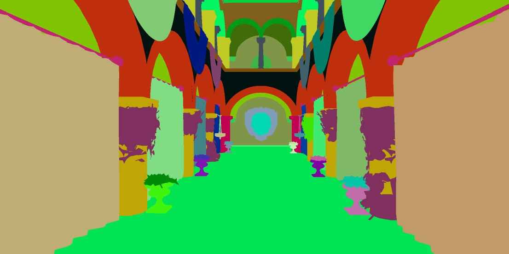
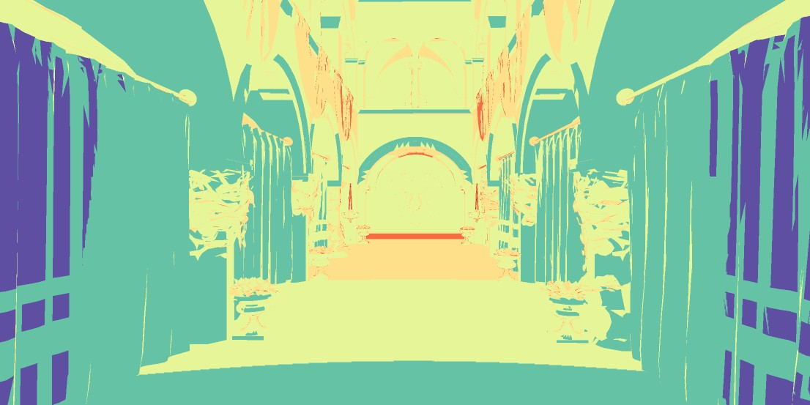
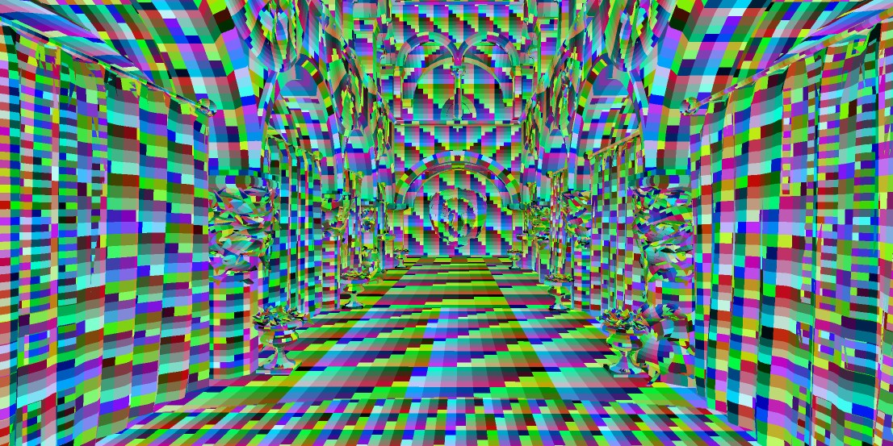
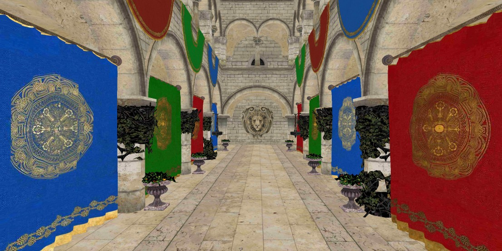
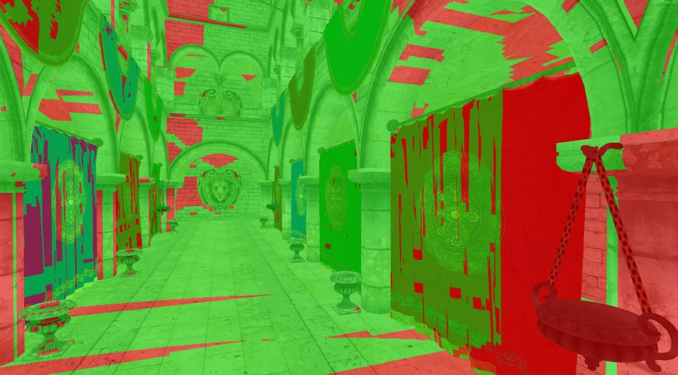
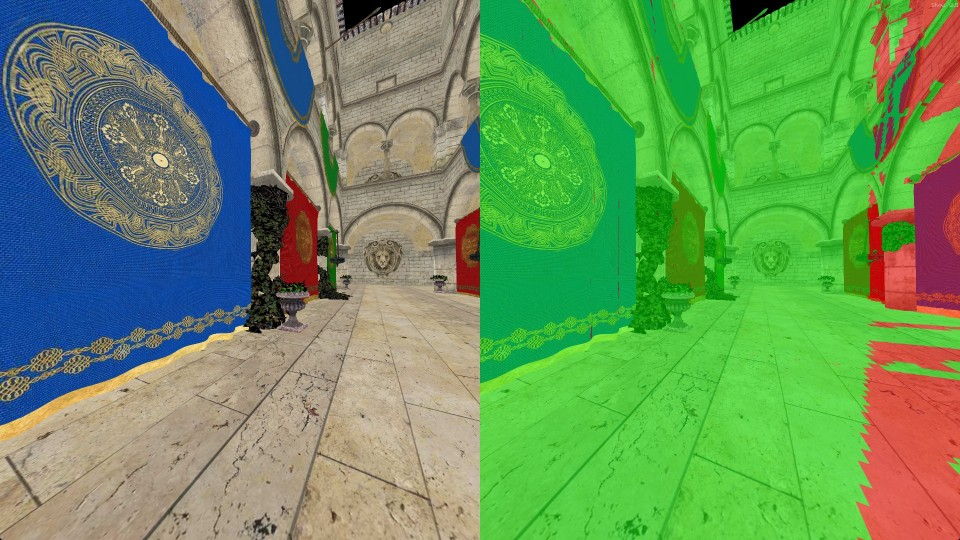

# Variable-Rate Texture Compression: Real-Time Rendering with JPEG

Elias Kristmann, Michael Wimmer, Markus Schütz



This project demonstrates that variable-rate compressed textures are viable on modern GPUs, achieving over 1500 FPS when rendering the Sponza scene with JPEG textures on an RTX 4090. The results of this work are a first step towards adopting more advanced formats such as AVIF and JPEG XL, which offer improved compression efficiency and could ultimately enable much larger texture datasets to fit within GPU memory.

The implementation uses OpenGL to first create a G-Buffer, and CUDA to decode the required JPEG blocks (aka <b>Minimum Coded Units - MCUs; 16 x 16 pixels</b>). The rendering pipeline comprises following passes:
- <b>Geometry Pass</b>: Create a G-Buffer with uv-coordinates, texture-id, and mip map level.
- <b>Mark Pass</b>: Identify the MCUs of the JPEGs that need decoding, and put them in a queue. A hash-map based texture block cache is used to only queue MCUs for decoding that were not visible in the previous frame.
- <b>Decode Pass</b>: Decodes the queued MCUs and stores the results in the texture block cache.
- <b>Resolve Pass</b>: Replace the G-Buffer components with the decoded texels. 

<table>
	<tr>
		<td width="20%"> </td>
		<td width="20%"></td>
		<td width="20%"></td>
		<td width="20%"></td>
		<td width="20%"></td>
	</tr>
	<tr>
		<td>(a) UVs</td>
		<td>(b) TexIDs</td>
		<td>(c) Mip Level</td>
		<td>(d) MCU IDs</td>
		<td>(e) Rendering</td>
	</tr>
	<tr>
		<td colspan="5">(a+b+c) G-Buffer components. (d) Visible MCUs of the JPEG textures. (e) Textured rendering, after decoding the required MCUs and subsequently replacing G-Buffer components with decoded texels.
		</td>
	</tr>
</table>

Take Aways:
- Texturing with JPEG needs less than 0.3ms per frame, showing that concepts of JPEG - and in the future AVIF and JPEG XL - could be adopted for efficient GPU-friendly, variable-rate compressed texture formats that require less than 1 bit per texel. 
- <b>Deferred rendering</b> is needed as it allows us to identify what needs decoding, then let workgroups collaboratively decode.
- <b>Mip Mapping</b> provides a massive performance boost for JPEG-based textures, as it reduces the amount of visible MCUs that need decoding to a fraction, e.g., from 81k to 12k in certain viewpoints in Sponza, or from 224k to 22k in another test scene (Graffiti).
- <b>Caching</b>: A texture block cache then further halves the time spent on the JPEG rendering pipeline in each frame. 
- <b>VR</b>: It scales well to VR since the left and the right eye share most of the visible MCUs. In VR, 0.65ms per frame is spent on the JPEG rendering pipeline, mainly due to the much higher framebuffer size (2MP on desktop vs. 6.8MP per eye in VR).

<table>
	<tr>
		<td> </td>
		<td></td>
	</tr>
	<tr>
		<td>Green: Cached MCUs from previous frame</td>
		<td>(VR) Green: Cached MCUs from left eye.</td>
	</tr>
</table>


## Installing


### Windows

Dependencies: 
* CUDA 12.4
* Visual Studio 2022 (version 17.10.3)
* A GPU with compute capability 8.6

Create Visual Studio solution files in a build folder via cmake:

```
mkdir build
cd build
cmake ../
```

### Linux

TODO

## Modifying

The most relevant files for modification are as follows:
<table>
	<tr>
		<td>main.cpp</td>
		<td></td>
	</tr>
	<tr>
		<td>SplatEditor_render.h</td>
		<td>Most of the relevant host-side OpenGL and CUDA calls.</td>
	</tr>
	<tr>
		<td>jpeg.cu</td>
		<td>Contains the kernels of the JPEG rendering pipeline: mark, decode and resolve</td>
	</tr>
</table>

